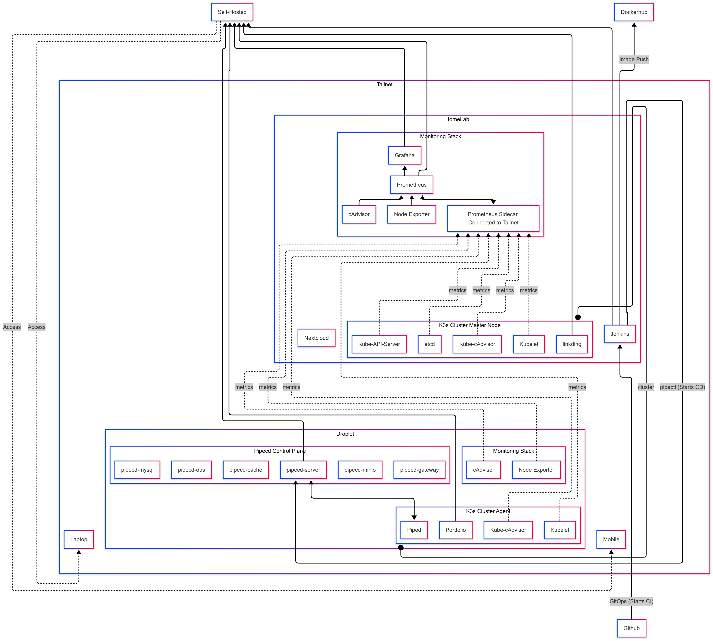
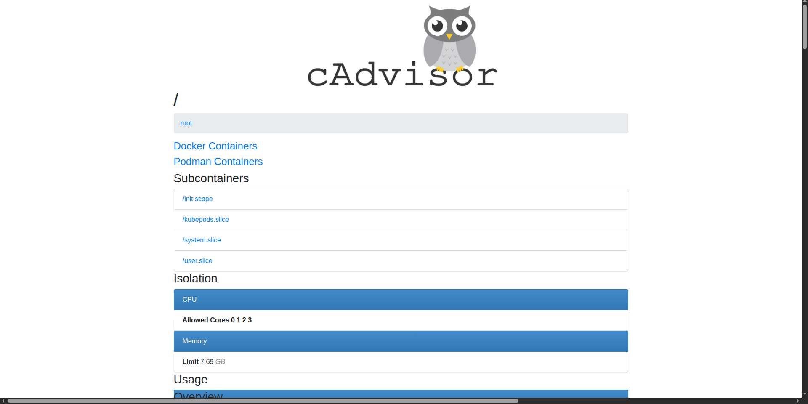
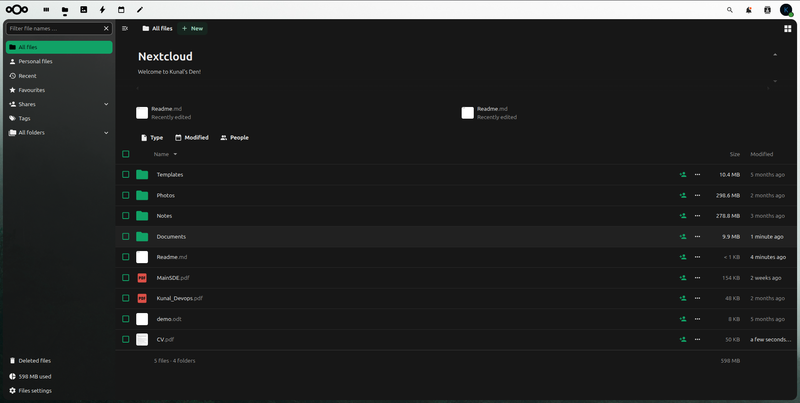
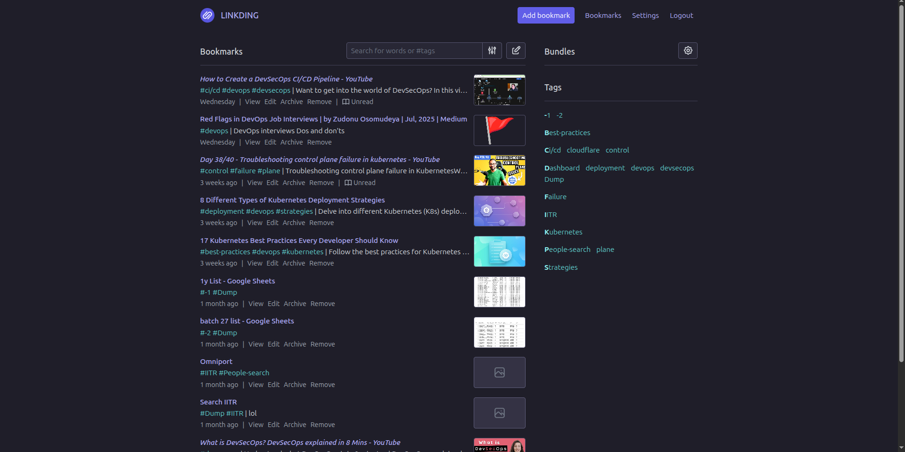
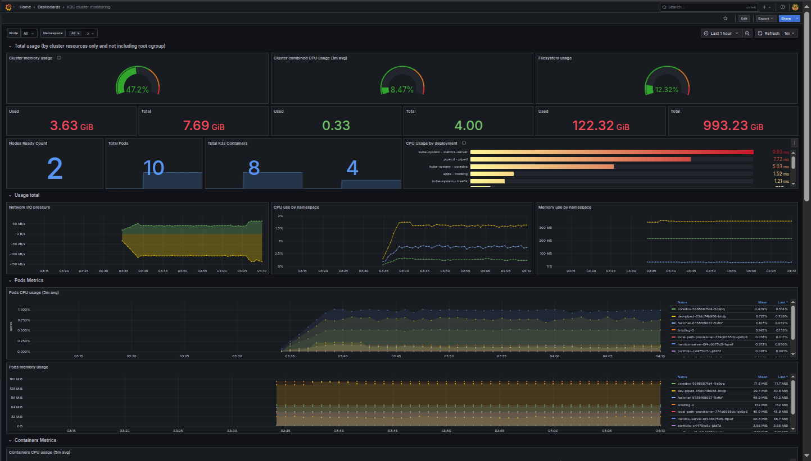
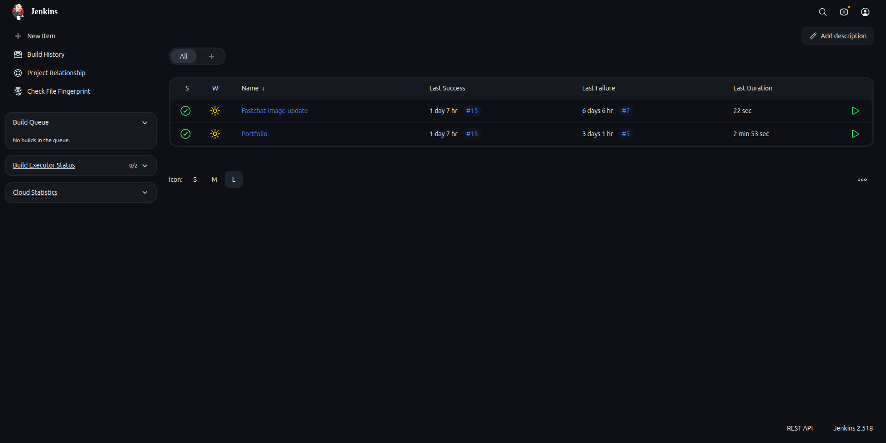
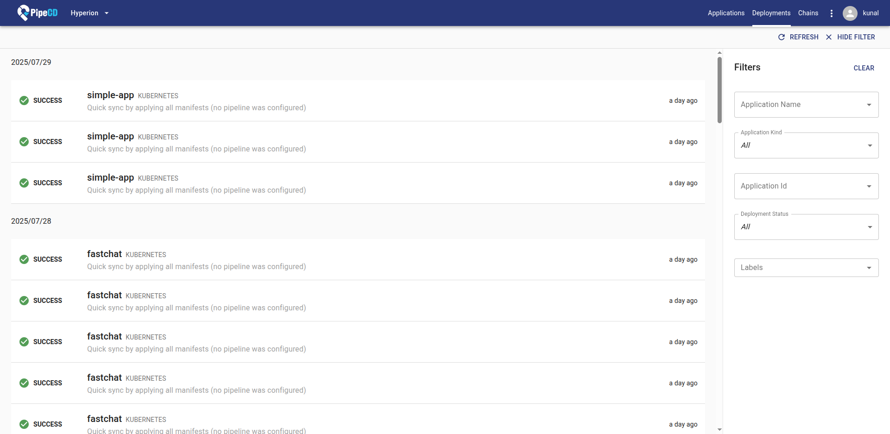

# Homelab

Welcome to my Homelab!  
This repository contains Docker Composes, Ansible Playbooks, Setup instructions and any relevant configuration files, for all self-hosted services running in my Homelab.  
Future self-hosted services and improvements will be continuously added to this repository as the Homelab evolves. The setup is designed to be modular, easy to extend and properly monitored while being a source of truth for all the kubernetes manifests and CICD pipelines running.
Instructions to deploy and manage each component are included within the respective compose and configuration files.

## Architecture

<strong>Homelab Architecture</strong>

This diagram is a representation of all the services that are running in my Homelab and how they are interconnected. The cluster has 2 nodes and are connected to my devices using Tailscale. The Homelab can be divided into 3 main sections:

<strong>

1) Self-hosted services in Docker containers  
2) The K3s cluster    
3) The CI/CD pipeline.  

</strong>

## Self-Hosted services

In my Homelab I have deployed various services directly using docker containers, which I use in my day to day life. All the docker composes used to deploy these services are present in this repo.  
The services start with my monitoring stack, which includes a compose of `Prometheus`, `Grafana`, `Node-Exporter` and `cAdvisor` for my master node and a smaller version of the same just having Node-Exporter and cAdvisor on the other worker nodes. 
Throughout this guide whenever I mention master node, it refers to my on-premise server. Any other nodes whether worker or remote refer to cloud instances such as DigitalOcean Droplets.

<strong>cAdvisor</strong>

Prometheus pulls metrics from the local node-exporter and cAdvisor containers but to access remote containers which are present on other nodes on the Tailnet, we need a way to let Prometheus access services deployed in my `Tailnet`. 
This is done using a `Tailscale sidecar container` that runs as a part of the same compose which is present in `./monitoring/monitoring_compose.yml`. This allows me to access my prometheus from any node which is in my tailnet and also allows prometheus to access other nodes directly by their DNS names.

This Prometheus is also used to fetch metrics from my K3s cluster. At the end, Grafana provides really good dashboards to identify and solve real time issues with my servers.   
Like why is my services slowing down?...Oh! it is because I am having high disk I/O overhead due to prometheus logs which showed me that I needed a new SSD. This was an actual issue that I encountered and helped me save my data from any random HDD crashes that could have occured.  

It also helps to track, the services which are taking up too much resources and optimise them. For more info about how to set this up with kubernetes, do checkout my blog on [Secure External Monitoring for my K3s Cluster](https://medium.com/@kunalvirwal/how-i-set-up-secure-external-monitoring-for-my-k3s-cluster-with-prometheus-and-tailscale-eba972dc19eb).  

Other than the monitoring stack I use `Nextcloud` to utilise my servers as a cloud storage which was a great relief. I also have deployed a docker compose for `Pipecd` and `Jenkins` which form my `CICD pipeline`.

<strong>Nextcloud</strong>

## K3s cluster

A Homelab is not complete, if it does not have a running Kubernetes Cluster. Most of my `DevOps` experiments and app testing happens on my K3s cluster. I have also deployed couple of services on my cluster like my own chat app `FastChat` which I use a lot for testing deployments. I have also deployed `Linkding` in my cluster, which along with Tailscale, allows access from all my devices.  

<strong>Linkding Bookmarks</strong>

The cluster is also a testing bench for my own projects which I can deploy publically using my droplet's `svclb pod` which comes packaged with K3s whenever I need the services to be public. A kubernetes cluster helps in learning a lot about DevOps and I feel that anyone who wishes to get into DevOps should at some point host their own Homelab.

Currently I am using this cluster for learning more about services like Jenkins and PipeCD and learning how to implement CICD pipelines and my `portfolio` is hosted there too. The cluster can also be used to host apps like Homarr which help you keep track of all the services you are running. 

Two types of monitoring can be used to track the events happening in the cluster. The first is to use internal monitoring which includes the `Prometheus-Operator` Helm chart a.k.a. `Kube-prometheus-stack`. For more info refer to [monitoring_kube-prometheus-stack.md](./k3s/monitoring/internal/monitoring_kube-prometheus-stack.md). But I dont use this as my active source of metrics because if for some reason K3s would malfunction, we don't want our monitoring to go down with it. So a better way would be to use external monitoring using the docker compose we mentioned earlier. For more info about how to set this up with kubernetes, do checkout my blog on [Secure External Monitoring for my K3s Cluster](https://medium.com/@kunalvirwal/how-i-set-up-secure-external-monitoring-for-my-k3s-cluster-with-prometheus-and-tailscale-eba972dc19eb).

Again Grafana proves to be a great debuging tool, to know what going on with the cluster.

<strong>K3s Monitoring Dashboard</strong>

## CICD Pipelines

Now, this is a new addition to my Homelab. I was recently introduced to the concept of `Fire and Forget GitOps` which at first didn't seem a big thing but after trying it out, I want to set it up for all my projects. Just push you code to Github and in a couple of minutes you can see the same code deployed on to your cluster. This is achieved through a combination of two services called Jenkins for CI and PipeCD for CD operations.  

A very basic example of a currently deployed pipelines is a pipeline which builds a docker images and pushes that onto Dockerhub and then begins the CD ops which updates all the manifests and reapplies the new manifests to the cluster. Upon a `git push`, Jenkins realises that the remote has been updated, this can be done using a Github hook, if you have static IP or domain for your Jenkins, otherwise another way is to use `poll scm` which polls Github for changes. 

<strong>Jenkins Dashboard</strong>

Onces changes are detected, it follows the `Jenkinsfile` provided in the repo and uses one of its agents to generate Docker images and the push them to `DockerHub`. Currently I use this [Jenkinsfile](./jenkins/ImageBuildnPushJenkinsfile), which updates the Dockerhub image, deletes the last iteration of docker images if successful and then notifies PipeCD to start the CD operations usign the `pipectl event register` command.  

Upon registering an event, PipeCD's eventwatcher makes a commit onto the remote repo which is being tracked by `Piped` and contains the manifests for the cluster like this one. Any updates mentioned in the event are commited and pushed to remote. Piped (PipeCD's agent running as a pod in the cluster) detects that a new commit has been pushed to the remote repo and applies the new changes to the cluster. This way a simple git push triggers a fully automated pipeline.

<strong>PipeCD Deployment Dashboard</strong>

This repo also contains some additional manifests like my ansible playbooks that I might use during updating and maintaining my Homelab and some other scripts, guides and my documented steps for each service. It acts as a source of truth of my manifest but also as a guide for setting up my Homelab. This repo is still under development and updates and improvements will be continued for it.

If you find any improvements or vulnerabilites, do reach out to me at `kunalvirwal@gmail.com`.

Made with ❤️ by Kunal

